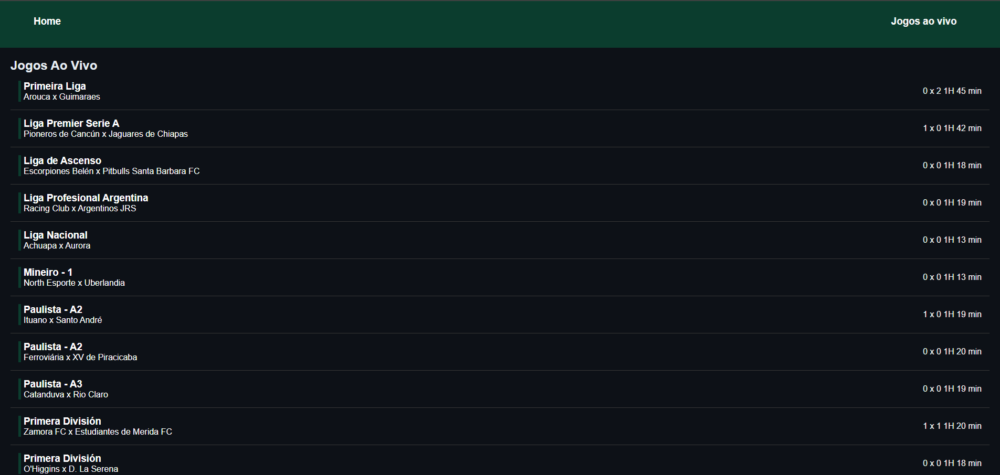
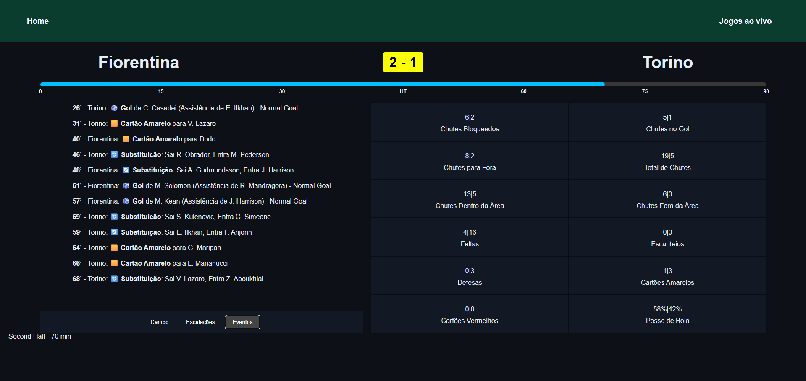

# Radar de futebol

  Radar de partidas de futebol em tempo real, com integração entre frontend e backend próprio via rotas REST.
  Consumo de API externa com Node, atualizações dinâmicas via polling, interface responsiva em React.

  Cache com Redis, reduzindo o tempo médio de resposta de ~738ms (API externa) para ~0.9ms (Redis) — tornando o backend +800x mais rápido em requisições subsequentes.


## Preview da tela inicial contendo os jogos ao vivo no dia
  
## Preview do radar funcionando com os dados de um jogo ao vivo 
(Fiorentina x Torino - 07/02/2026, 70 min de jogo)
  

## Tecnologias

### 🖥️ Frontend

  - **React.js** com **Vite**
  - **React Router DOM** para navegação entre páginas
  - Requisições assíncronas ao backend via `axios`
  - CSS **responsivo**, adaptadando a interface para telas menores

### ⚙️ Backend

  - **Node.js** com **Express**
  - Estrutura com `controller` e `routes`
  - Integração com **API externa** da [api-football](https://www.api-football.com/)
  - Atualização de dados com **polling**
  - Uso de **Redis** para cache e redução de requisições repetidas

## Funcionalidades

  - Lista de partidas ao vivo
  - Detalhamento completo da partida:
    
    - Placar em tempo real
    - Tempo de jogo
    - Escalações
    - Eventos
    - Estatísticas

## Sobre a API

  Esse projeto utiliza a [API da api-football](https://www.api-football.com/) para obter dados em tempo real de partidas de futebol.
  
  ⚠️ **Atenção:** a API requer uma chave de acesso (API Key), o projeto **não funcionará corretamente sem uma chave válida**.

  No momento a API está ativa com o plano gratuito, com 100 requisições por dia, portanto, o polling foi reduzido para não buscar dados a todo momento.
  No entanto, com a API paga, é possível atualizar mais frequentemente, mantendo o radar praticamente ao vivo.

## 🛠️ Como rodar localmente

1. Clone o repositório:

   ```bash
   git clone git@github.com:LippeTK/radar-esportivo.git

   ```

2. Instale as dependências:

   cd backend && npm install

   cd ../frontend && npm install

3. Redis (cache)

    Este projeto utiliza **Redis** para armazenar dados em cache e evitar múltiplas chamadas à API externa.
    ### Windows
    
    - **Recomendado**: usar o Redis via [WSL](https://learn.microsoft.com/pt-br/windows/wsl/install)
    - **Alternativas**: instalar via [Memurai](https://www.memurai.com/) ou usar [Docker](https://hub.docker.com/_/redis)
    
    #### 🐧 Linux (Ubuntu/Debian)
    ```
    bash
    sudo apt update
    sudo apt install redis-server
    sudo systemctl enable redis
    sudo systemctl start redis
    
    shell
    Copiar
    Editar
    ```
    #### Como verificar se o Redis está rodando
    ```
    bash
    redis-cli ping
    #Esperado: PONG
    ```
   
4. Solicitar acesso à API no site oficial
   
    Criar `.env` com base no `.env.example`
   
    A estrutura do código está preparada para funcionar assim que uma chave for fornecida no `.env`.

6. Rode o backend e o frontend separadamente:
  
  ```
    cd backend
    npm start
    cd ../frontend
    npm run dev
  ```

## 📸 Preview

Quer ver o projeto em ação? Confira **[aqui](https://imgur.com/a/6acBmpG)**!

Desenvolvido por
Felipe Carvalho
